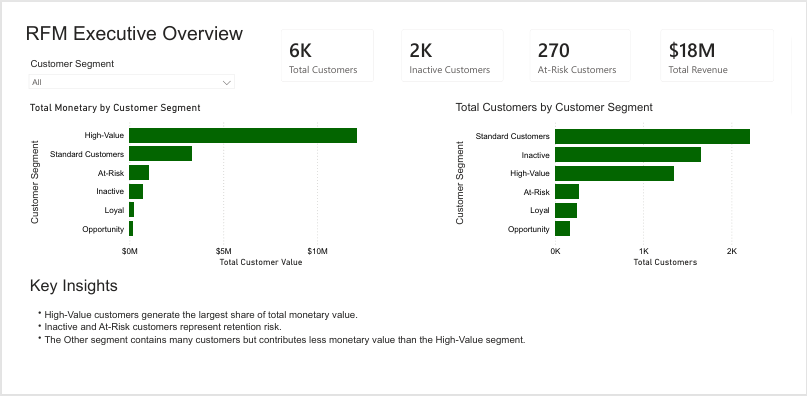
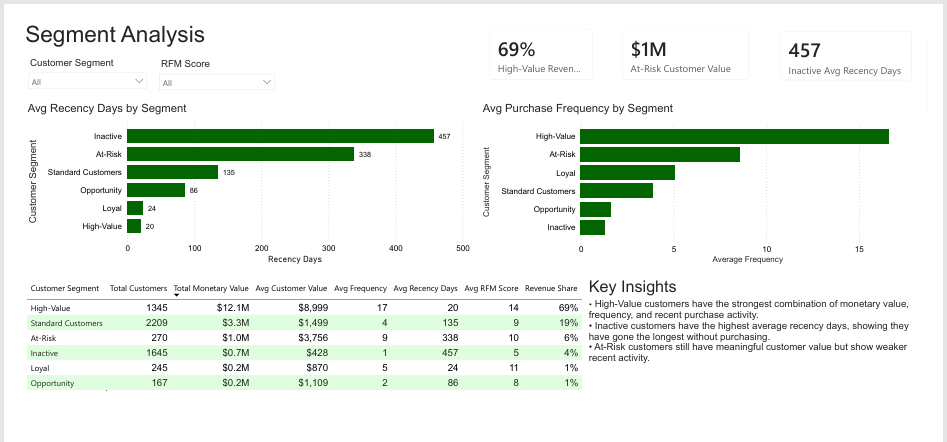
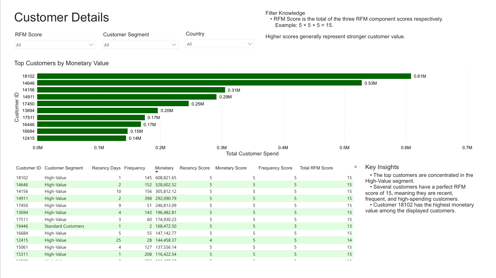

# Customer Segmentation / RFM Analysis
## Overview

This project analyzes ecommerce transaction data to segment customers based on purchasing behavior using RFM analysis. The goal is to identify high-value customers, loyal customers, at-risk customers, inactive customers, and potential reactivation opportunities.

RFM analysis uses three customer behavior metrics:

- Recency: How recently a customer made a purchase
- Frequency: How often a customer purchased
- Monetary: How much revenue a customer generated

These metrics were used to score and classify customers into meaningful business segments.

## Objective

The main objective was to use customer purchase history to answer the following business questions:

- Which customers are the most valuable?
- Which customers purchase frequently?
- Which customers have not purchased recently?
- Which customer segments generate the most revenue?
- Which customers may be at risk of becoming inactive?
- Which customers may represent reactivation or growth opportunities?

## Tools Used
- Excel / Power Query: Data exploration, worksheet appending, initial cleaning, and preparation
- SQL: Data type correction, validation, RFM calculation, scoring, and segmentation
- Power BI: Dashboard design, KPI reporting, and visual analysis

## Dataset

The project uses the Online Retail II ecommerce dataset, which contains transaction-level sales records across two worksheets:

- Year 2009-2010
- Year 2010-2011

The combined workbook contains 1,067,371 transaction line records before cleaning.

Key fields include:

- Invoice number
- Stock code
- Product description
- Quantity
- Invoice date
- Unit price
- Customer ID
- Country

The two worksheet date ranges overlap from 2010-12-01 through 2010-12-09, so duplicate records were reviewed and removed after the two sheets were appended into one combined transaction table.

## Data Cleaning Process

The raw workbook was preserved separately before cleaning. The two yearly worksheets were appended in Excel / Power Query to create one combined transaction table for analysis.

## Cleaning steps included:

- Appended the two yearly worksheets into one transaction table
- Removed duplicate records created by overlapping worksheet date ranges
- Removed records with blank Customer ID values
- Removed rows with negative quantities, which represented returns or canceled transactions
- Removed rows with invalid or negative unit prices
- Converted invoice date values into a proper date format
- Converted price values into numeric currency/decimal format
- Reviewed data types before loading the cleaned data into SQL

These steps ensured the final dataset only included valid customer purchase transactions suitable for RFM analysis.

## SQL Data Preparation

After importing the cleaned transaction data into SQL, additional validation and type corrections were performed.

The invoice date column was converted from text format into a proper SQL DATE data type. Price values were converted into a numeric decimal format so they could be used accurately in revenue calculations.

The cleaned SQL table was then used as the source for customer-level RFM calculations.

## SQL Analysis

SQL was used to calculate customer-level RFM metrics:

- Recency: Number of days between the analysis date and the customer’s most recent purchase
- Frequency: Number of unique invoices/orders per customer
- Monetary: Total spending per customer

The analysis date was based on the latest invoice date in the dataset, plus one day. This allowed recency to be measured relative to the dataset period rather than the current calendar date.

A SQL view was created to store the RFM logic and customer segment classifications.

## RFM View

The SQL view calculates:

- Last purchase date
- Recency days
- Frequency
- Monetary value
- Recency score
- Frequency score
- Monetary score
- Total RFM score
- RFM code
- Customer segment

## Customer Segments

Customers were classified into the following segments:

### Segment	Description
- High-Value	Customers who purchased recently, purchase frequently, and spend the most
- Loyal	Customers who purchased recently and purchase frequently
- At-Risk	Customers who previously purchased often or spent well but have not purchased recently
- Inactive	Customers who have not purchased recently and have low purchase frequency
- Opportunity	Customers with potential to become more valuable through repeat purchases
- Other	Customers who do not clearly fit into the main segment categories

## Power BI Report

The Power BI report contains three pages:

### 1. RFM Executive Overview
This page provides a high-level summary of customer segmentation performance. It includes KPI cards for total customers, inactive customers, at-risk customers, and total monetary value. It also compares total monetary value and total customer count by customer segment.

### 2. Segment Analysis
This page compares customer behavior across RFM segments. It includes average recency days, average purchase frequency, total customers, total monetary value, average customer value, average RFM score, and revenue share by segment.

### 3. Customer Details
This page provides customer-level detail for deeper analysis. It includes top customers by monetary value, customer RFM metrics, customer segment, RFM score, country, and filters for customer segment, country, and RFM score.

## Key Insights

- High-Value customers generated the largest share of total monetary value, contributing approximately 69% of total revenue.
- The Standard Customers contained the largest number of customers but contributed much less monetary value than the High-Value segment.
- Inactive customers had the highest average recency days, showing that they had gone the longest without purchasing.
- At-Risk customers still showed meaningful customer value but weaker recent activity, making them a possible target for reactivation campaigns.
- High-Value customers had the strongest combination of monetary value, frequency, and recent purchase activity.

## Report Screenshots

### RFM Executive Overview

### Segment Analysis

### Customer Details

